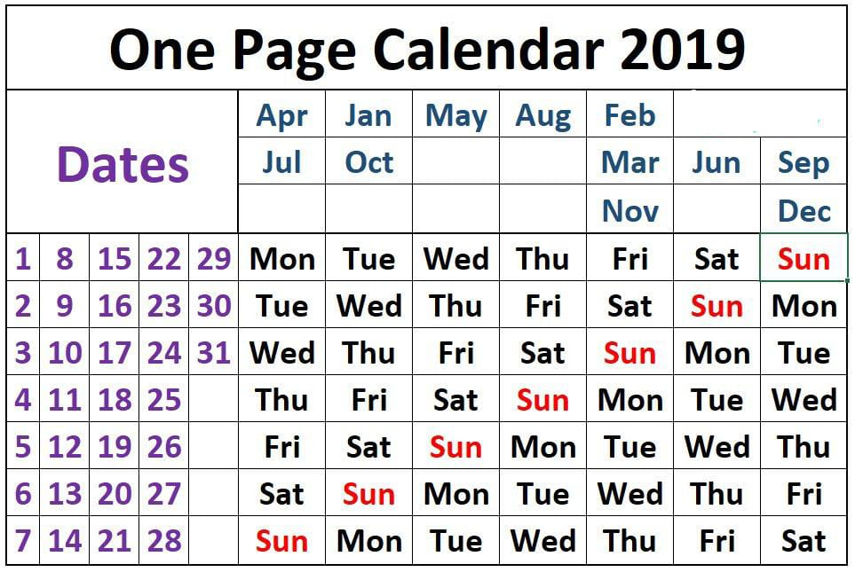

# One Page Calendar

## Background

I was inspired by this post on [HackerNews](https://news.ycombinator.com/item?id=21921165) to re-create a terminal version of the same calendar.

I have transposed the original design as I felt having the numbers on top makes it more readable. Along with the months on the side as reading left-to-right is more comprehensible for the human eye (atleast from a Westerner's perspective).

At the moment, it's a simple Python script that runs and prints to stdout. The pixel calculations are all magic numbers that needs to be generalised. See the wishlist below, I will cross off tasks as I work through them.

## Usage

Make sure you are running Python 3.6+

```plain
$ python one_page_calendar.py
                  2020
               1   2   3   4   5   6   7
               8   9  10  11  12  13  14
              15  16  17  18  19  20  21
              22  23  24  25  26  27  28
              29  30  31
            ┌----------------------------
        Jun | Mon Tue Wed Thu Fri Sat Sun
    Sep Dec | Tue Wed Thu Fri Sat Sun Mon
Jan Apr Jul | Wed Thu Fri Sat Sun Mon Tue
        Oct | Thu Fri Sat Sun Mon Tue Wed
        May | Fri Sat Sun Mon Tue Wed Thu
    Feb Aug | Sat Sun Mon Tue Wed Thu Fri
    Mar Nov | Sun Mon Tue Wed Thu Fri Sat
```

## How to read the one page calendar

This variant of the one page calendar is really a glorified day look-up calendar. Given a date, you can look up what day it falls on.

For example,

> "What day does the 26th of January fall on this year?"

1. Find 26 on the left hand side
2. Find Jan at the top.
3. Find the point at which 26 and Jan intersect: Sun.

This means Jan 26th falls on a Sunday in the year 2019.


Source: [Reddit](https://www.reddit.com/r/coolguides/comments/ad5dbu/onr_page_calendar_2019/)

Another way to use it is to help answer a question such as,

> "How many Friday the 13ths are there this year?"

1. Find 13 on the left hand side
2. Follow the days horizontally (from left to right) until you find Friday.
3. From here, look up to find the months: Sep and Dec.

This means September and December are the two months in 2019 that have a Friday the 13th.

## Wishlist

The inbuilt python `curses` module is being considered for a more flexible version of the calendar.

## Caveat

Obviously this is not a real calendar. In the 2019 calendar, there is no such thing as Feb 30th or Feb 31st!

However, if you interpret Feb 30th as Mar 2nd as a date overflow into the next month, you'll notice that both point to **Sat**.
